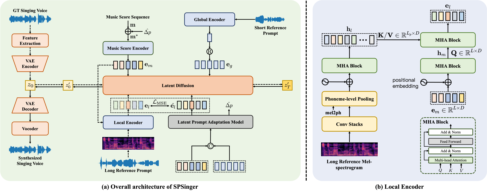

## Abstract of the paper

Current singing voice synthesis systems often struggle in multi-singer scenarios due to limited training data that only includes a few singers. Existing zero-shot multi-singer singing voice synthesis systems are criticized for their reliance on global timbre embeddings from single reference audio, which fail to capture sufficient timbre details. This paper introduces SPSinger, a multi-singer singing voice synthesizer that generates singer-specific voices from brief reference audio (around \textit{5 seconds}) without prior training on the singer's voice. 
SPSinger builds on the StableDiffusion framework by adding a global encoder to capture consistent timbre features from short reference prompts and an attention-based local encoder to capture detailed variations from long prompts, used only during training. 
To overcome the challenge of requiring long audio prompts during inference, we introduce the Latent Prompt Adaptation Model (LPAM), a Transformer-based module that derives timbre features from global embeddings. This approach eliminates the need for long reference prompts. Additionally, we propose a novel pitch shift algorithm that uses LPAM to predict the pitch shift values.
Our experiments show that SPSinger achieves high-quality singing voice synthesis that preserves the identity of the target singer, even when using only short reference audio inputs in zero-shot scenarios.

    
    <figcaption>Fig.1 Overall Architecture of SPSinger.</figcaption>

## Synthesis Results on Seen Singers
 
<table>
    <thead>
        <tr>
            <th colspan="4">Synthesis on Seen Singers with Short Music Scores</th>
        </tr>
    </thead>
    <tbody>
       <tr>
            <td>
Singers
</td>
            <td>
GT mel + Vocoder
</td>
            <td>
Reference
</td>
            <td>
SPSinger
</td>
        </tr>
        <tr>
            <td>Female Singer 0</td>
            <td>
                <audio controls>
                  <source src="short_seen/female_0_short_seen/ground_truth.wav" type="audio/mpeg">
                  Your browser does not support the audio tag.
                </audio>
            </td>
            <td>
                <audio controls>
                  <source src="short_seen/female_0_short_seen/reference.wav" type="audio/mpeg">
                  Your browser does not support the audio tag.
                </audio>
            </td>
            <td>
                <audio controls>
                  <source src="short_seen/female_0_short_seen/spsinger.wav" type="audio/mpeg">
                  Your browser does not support the audio tag.
                </audio>
            </td>
        </tr>
        <tr>
            <td>Female Singer 1</td>
            <td>
                <audio controls>
                  <source src="short_seen/female_1_short_seen/ground_truth.wav" type="audio/mpeg">
                  Your browser does not support the audio tag.
                </audio>
            </td>
            <td>
                <audio controls>
                  <source src="short_seen/female_1_short_seen/reference.wav" type="audio/mpeg">
                  Your browser does not support the audio tag.
                </audio>
            </td>
            <td>
                <audio controls>
                  <source src="short_seen/female_1_short_seen/spsinger.wav" type="audio/mpeg">
                  Your browser does not support the audio tag.
                </audio>
            </td>
        </tr>
        <tr>
            <td>Female Singer 2</td>
            <td>
                <audio controls>
                  <source src="short_seen/female_2_short_seen/ground_truth.wav" type="audio/mpeg">
                  Your browser does not support the audio tag.
                </audio>
            </td>
            <td>
                <audio controls>
                  <source src="short_seen/female_2_short_seen/reference.wav" type="audio/mpeg">
                  Your browser does not support the audio tag.
                </audio>
            </td>
            <td>
                <audio controls>
                  <source src="short_seen/female_2_short_seen/spsinger.wav" type="audio/mpeg">
                  Your browser does not support the audio tag.
                </audio>
            </td>
        </tr>
        <tr>
            <td>Male Singer 0</td>
            <td>
                <audio controls>
                  <source src="short_seen/male_0_short_seen/ground_truth.wav" type="audio/mpeg">
                  Your browser does not support the audio tag.
                  </audio>
            </td>
            <td>
                <audio controls>
                  <source src="short_seen/male_0_short_seen/reference.wav" type="audio/mpeg">
                  Your browser does not support the audio tag.
                </audio>
            </td>
            <td>
                <audio controls>
                  <source src="short_seen/male_0_short_seen/spsinger.wav" type="audio/mpeg">
                  Your browser does not support the audio tag.
                </audio>
            </td>
        </tr>
        <tr>
            <td>Male Singer 1</td>
            <td>
                <audio controls>
                  <source src="short_seen/male_1_short_seen/ground_truth.wav" type="audio/mpeg">
                  Your browser does not support the audio tag.
                  </audio>
            </td>
            <td>
                <audio controls>
                  <source src="short_seen/male_1_short_seen/reference.wav" type="audio/mpeg">
                  Your browser does not support the audio tag.
                </audio>
            </td>
            <td>
                <audio controls>
                  <source src="short_seen/male_1_short_seen/spsinger.wav" type="audio/mpeg">
                  Your browser does not support the audio tag.
                </audio>
            </td>
        </tr>
        <tr>
            <td>Male Singer 2</td>
            <td>
                <audio controls>
                  <source src="short_seen/male_2_short_seen/ground_truth.wav" type="audio/mpeg">
                  Your browser does not support the audio tag.
                  </audio>
            </td>
            <td>
                <audio controls>
                  <source src="short_seen/male_2_short_seen/reference.wav" type="audio/mpeg">
                  Your browser does not support the audio tag.
                </audio>
            </td>
            <td>
                <audio controls>
                  <source src="short_seen/male_2_short_seen/spsinger.wav" type="audio/mpeg">
                  Your browser does not support the audio tag.
                </audio>
            </td>
        </tr>
    </tbody>
    <thead>
        <tr>
            <th colspan="4">Synthesis on Seen Singers with Long Music Scores</th>
        </tr>
    </thead>
    <tbody>
        <tr>
            <td>
Singers
</td>
            <td>
GT mel + Vocoder
</td>
            <td>
Reference
</td>
            <td>
SPSinger
</td>
        </tr>
        <tr>
            <td>Female Singer 0</td>
            <td>
                <audio controls>
                  <source src="long_seen/female_0_long_seen/ground_truth.wav" type="audio/mpeg">
                  Your browser does not support the audio tag.
                  </audio>
            </td>
            <td>
                <audio controls>
                  <source src="long_seen/female_0_long_seen/reference.wav" type="audio/mpeg">
                  Your browser does not support the audio tag.
                </audio>
            </td>
            <td>
                <audio controls>
                  <source src="long_seen/female_0_long_seen/spsinger.wav" type="audio/mpeg">
                  Your browser does not support the audio tag.
                </audio>
            </td>
        </tr>
        <tr>
            <td>Female Singer 1</td>
            <td>
                <audio controls>
                  <source src="long_seen/female_1_long_seen/ground_truth.wav" type="audio/mpeg">
                  Your browser does not support the audio tag.
                  </audio>
            </td>
            <td>
                <audio controls>
                  <source src="long_seen/female_1_long_seen/reference.wav" type="audio/mpeg">
                  Your browser does not support the audio tag.
                </audio>
            </td>
            <td>
                <audio controls>
                  <source src="long_seen/female_1_long_seen/spsinger.wav" type="audio/mpeg">
                  Your browser does not support the audio tag.
                </audio>
            </td>
        </tr>
        <tr>
            <td>Female Singer 2</td>
            <td>
                <audio controls>
                  <source src="long_seen/female_2_long_seen/ground_truth.wav" type="audio/mpeg">
                  Your browser does not support the audio tag.
                  </audio>
            </td>
            <td>
                <audio controls>
                  <source src="long_seen/female_2_long_seen/reference.wav" type="audio/mpeg">
                  Your browser does not support the audio tag.
                </audio>
            </td>
            <td>
                <audio controls>
                  <source src="long_seen/female_2_long_seen/spsinger.wav" type="audio/mpeg">
                  Your browser does not support the audio tag.
                </audio>
            </td>
        </tr>
        <tr>
            <td>Male Singer 0</td>
            <td>
                <audio controls>
                  <source src="long_seen/male_0_long_seen/ground_truth.wav" type="audio/mpeg">
                  Your browser does not support the audio tag.
                  </audio>
            </td>
            <td>
                <audio controls>
                  <source src="long_seen/male_0_long_seen/reference.wav" type="audio/mpeg">
                  Your browser does not support the audio tag.
                </audio>
            </td>
            <td>
                <audio controls>
                  <source src="long_seen/male_0_long_seen/spsinger.wav" type="audio/mpeg">
                  Your browser does not support the audio tag.
                </audio>
            </td>
        </tr>
        <tr>
            <td>Male Singer 1</td>
            <td>
                <audio controls>
                  <source src="long_seen/male_1_long_seen/ground_truth.wav" type="audio/mpeg">
                  Your browser does not support the audio tag.
                  </audio>
            </td>
            <td>
                <audio controls>
                  <source src="long_seen/male_1_long_seen/reference.wav" type="audio/mpeg">
                  Your browser does not support the audio tag.
                </audio>
            </td>
            <td>
                <audio controls>
                  <source src="long_seen/male_1_long_seen/spsinger.wav" type="audio/mpeg">
                  Your browser does not support the audio tag.
                </audio>
            </td>
        </tr>
        <tr>
            <td>Male Singer 2</td>
            <td>
                <audio controls>
                  <source src="long_seen/male_2_long_seen/ground_truth.wav" type="audio/mpeg">
                  Your browser does not support the audio tag.
                  </audio>
            </td>
            <td>
                <audio controls>
                  <source src="long_seen/male_2_long_seen/reference.wav" type="audio/mpeg">
                  Your browser does not support the audio tag.
                </audio>
            </td>
            <td>
                <audio controls>
                  <source src="long_seen/male_2_long_seen/spsinger.wav" type="audio/mpeg">
                  Your browser does not support the audio tag.
                </audio>
            </td>
        </tr>
    </tbody>
</table>

